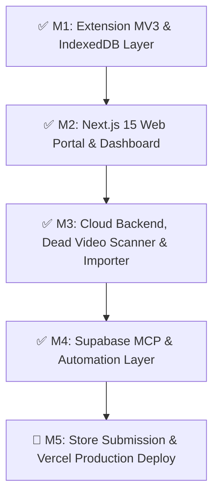

# 📋 Independent YouTube Playlist Manager (YPH) — Project Roadmap & Task Tracking

> **Status:** Active Development & Integration  
> **Last Updated:** August 2026  
> **Architecture Spec:** [AGENTS.md](AGENTS.md)

---

## 🧭 Milestone Overview & Execution Status



---

## 📌 Milestone Breakdown & Task Tracker

### ✅ Milestone 1: Extension Architecture & Multi-Gigabyte Storage
- [x] Request `unlimitedStorage` permission in Chrome & Firefox manifests.
- [x] Build dedicated zero-library native IndexedDB wrapper (`yph_metadata_db_v2` in `playlist-editor/src/services/db-service.ts`).
- [x] Implement 5-tier zero-quota metadata extraction pipeline (Innertube `MWEB`, Embed headless, oEmbed, Data API v3, Piped/Invidious).
- [x] Implement full database export/import pipeline (`backup-service.ts`, Schema v2 JSON, CSV, M3U).
- [x] Fix Firefox Android compatibility (Fenix touch-optimized layouts and user-agent detection).

### ✅ Milestone 2: Next.js 15 Web Portal & Responsive Dashboard
- [x] Initialize Next.js 15 App Router with Tailwind CSS and dark mode theme in `web/`.
- [x] Build floating navigation header with mobile Sheet Drawer (`sheet.tsx`).
- [x] Build interactive Live Extension Simulator with 0-quota refetch simulation and offline/online latency indicators.
- [x] Build authenticated cloud dashboard (`DashboardView.tsx`) with playlist manager, global video catalog, and sync token generator.
- [x] Optimize UI for zero Cumulative Layout Shift (CLS) with pre-allocated aspect-video containers (`video-thumbnail.tsx`) and 44px minimum touch targets.

### ✅ Milestone 3: Live Cloud Backend & Smart Playlist Curation
- [x] Create production PostgreSQL schema with Row-Level Security (`web/supabase/schema.sql`).
- [x] Implement Supabase server and browser client integration with graceful offline fallback (`web/src/lib/supabase.ts`).
- [x] Build Next.js server API routes (`/api/sync`, `/api/tokens`, `/api/convert/spotify`).
- [x] Build diagnostic Dead & Private Video Scanner with 1-click clean deduplication (`curation-engine.ts`).
- [x] Build AI Semantic Auto-Tagger and Multi-Dimensional Smart Sorter (`curation-engine.ts`).
- [x] Build Spotify / Apple Music / Text Tracklist to YouTube converter (`music-importer.ts`).
- [x] Configure GitHub Actions CI and Release Bot (`.github/workflows/ci.yml`, `.github/workflows/release.yml`).

---

## 🔌 Milestone 4: MCP Server Integration Plan

This milestone integrates Model Context Protocol (MCP) servers to give the AI agent direct, secure access to database operations, browser automation, and repository release management.

### 📋 MCP Server Action Items

| Priority | MCP Server | Purpose & Capabilities | Configuration Target | Status |
|---|---|---|---|---|
| **P1** | **Supabase / PostgreSQL MCP** | Direct query execution, schema migrations, and live snapshot inspection | `.agents/plugins/supabase/` & `settings.json` | ✅ Connected & Active |
| **P2** | **GitHub MCP** | Automated PR creation, issue triage, and GitHub release tagging | `~/.gemini/config/mcp_config.json` | 🔲 Ready for Setup |
| **P3** | **Playwright / Puppeteer MCP** | Automated end-to-end browser test execution and screenshot verification | `.agents/plugins/testing/` | 🔲 Ready for Setup |
| **P4** | **YouTube Data API MCP** | Direct channel query validation and official quota monitoring | `.agents/plugins/youtube/` | 🔲 Optional |

---

## 🚀 Milestone 5: Production Deployment & Store Distribution

- [x] **Supabase Live Deployment:**
  - [x] Create Supabase project and execute production migrations via MCP (`init_yph_schema_and_todos`, `optimize_rls_and_indexes`).
  - [x] Set `NEXT_PUBLIC_SUPABASE_URL` and `NEXT_PUBLIC_SUPABASE_PUBLISHABLE_KEY` in `web/.env.local`.
  - [x] Configure end-to-end Row-Level Security (RLS) with zero security advisor warnings and full TypeScript types (`database.types.ts`).
- [ ] **Web SaaS Portal Deployment:** (requires Vercel/Cloudflare account credentials)
  - [x] Add `web/vercel.json` (Next.js framework, build/install commands) — deploy-ready config committed.
  - [ ] Connect `web/` repository to **Vercel** or **Cloudflare Pages** (manual: needs owner login).
  - [ ] Configure production domain (e.g. `youtubeplaylisthelper.com` or `yph.dev`).
- [ ] **Chrome Web Store Submission:** (requires Google developer account + one-time $5 fee)
  - [x] Package production ZIP via `npm run pack` (`dist/independent-youtube-playlist-manager-chrome.zip`) — automated, also produced by `.github/workflows/release.yml`.
  - [ ] Submit package to Google Chrome Developer Dashboard under Extension ID `lppdplclfhchgkgckfmkopomahlpfjok`.
- [ ] **Mozilla Firefox AMO Submission:** (requires Mozilla AMO account)
  - [x] Package ZIP via `npm run pack` (`dist/independent-youtube-playlist-manager-firefox.zip`) — automated, also produced by `.github/workflows/release.yml`.
  - [ ] Submit package to Mozilla Add-ons Developer Hub under Gecko ID `{790842fe-fecb-4375-a127-95c1c1d35d3e}`.

---

## 🧪 Verification & Health Check Commands

```bash
# 1. Typecheck Svelte 5 Extension SPA
cd playlist-editor && npx svelte-check && cd ..

# 2. Build WebExtension Dist (Chrome MV3 + Firefox Gecko 140+)
npm run build

# 3. Build Next.js 15 Web Portal & API routes
npm run web:build

# 4. Start Next.js Development Server (http://localhost:3000)
npm run web
```
